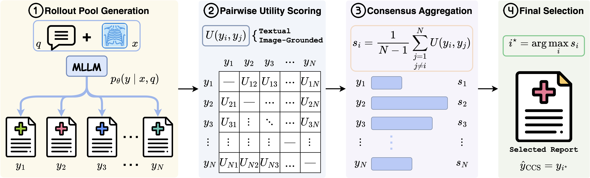

<!-- Add logo here -->
<h1 align="center">
  
  <strong>CCS: Clinical Consensus Selection for Radiology Report Generation</strong>
</h1>


<div align="center">

<a href="https://git.io/typing-svg">
  
</a>

[](https://x-izhang.github.io/CCS/)
[](https://arxiv.org/abs/2605.30131)
[](https://github.com/X-iZhang/CCS/blob/main/LICENSE)
[](https://visitorbadge.io/status?path=https%3A%2F%2Fgithub.com%2FX-iZhang%2FCCS)

</div>

## 🔥 News
- **[28 May 2026]** ⛳ Our preprint is now live on [arXiv](https://arxiv.org/abs/2605.30131) — check it out for details.

## Overview
Radiology report generation (RRG) is typically cast as single-path decoding, where a multimodal large language model (MLLM) commits to one report token by token — so a single unfavourable step can drop a finding or assert one the image does not support. Yet a fixed model often places clinically stronger reports *elsewhere in its candidate pool*. We propose **C**linical **C**onsensus **S**election (**CCS**), a *reference-free* and *decoder-agnostic* inference-time framework that reframes RRG as candidate selection: it samples several reports and returns the one with the highest clinical consensus across the rollout pool. **`CCS`** combines text-based agreement utilities with an image–report-adapted multimodal utility, capturing clinical agreement beyond surface-level text. Across three datasets and multiple radiology MLLMs, **`CCS`** consistently improves inference-time quality over single-path decoding and generic Best-of-N baselines, with especially clear gains on clinical metrics — and requires no retraining, no architectural changes, and no reference reports.

<details open>
<summary>CCS's Framework</summary>



</details>

> [!NOTE]
> 🚧 Code, model checkpoints, and evaluation scripts are being prepared and will be released here soon. Stay tuned!

## 📝 Citation

If you find our paper and code useful in your research and applications, please cite using this BibTeX:

```bibtex
@article{zhang2026ccs,
  title={CCS: Clinical Consensus Selection for Radiology Report Generation},
  author={Zhang, Xi and Li, Yingshu and Meng, Zaiqiao and Lever, Jake and Ho, Edmond SL},
  journal={arXiv preprint arXiv:2605.30131},
  year={2026}
}
```

## 📚 Acknowledgments

This project builds upon the following outstanding open-source works:

- [**CCD**](https://github.com/X-iZhang/CCD) — Provides the batch inference framework that **`CCS`** uses to roll out and score candidate reports.
- [**Qwen3-VL-Embedding**](https://github.com/QwenLM/Qwen3-VL-Embedding) — Provides the training scripts for the multimodal embedding model behind our image-grounded utility.

We thank the authors for their valuable contributions to the open-source and medical AI communities.

## 📨 Contact
For any enquiries or collaboration opportunities, please reach out at: [**x.zhang.6@research.gla.ac.uk**](mailto:x.zhang.6@research.gla.ac.uk)

## 📜 License

This project is released under the MIT License — please see the [LICENSE](LICENSE) file for the full terms.

## 🧰 Intended Use

**CCS** is intended to **support** radiologists, researchers, and medical trainees in **drafting and reviewing chest X-ray reports**, by selecting the most clinically consistent candidate among several model outputs at inference time.

### Key Applications

- 🩺 **Clinical Decision Support** — Surfaces the candidate report that best agrees with the rest of the pool, helping radiologists draft and cross-check preliminary *findings*.
- 🎓 **Educational Tool** — Illustrates how candidate selection and clinical consensus shape report quality, useful for teaching radiology residents and students.
- 🔬 **Research Utility** — Provides a reference-free, decoder-agnostic testbed for studying inference-time selection and image-grounded utility in radiology report generation.

>[!IMPORTANT]
> All outputs must be reviewed and validated by **qualified radiologists or medical professionals** before informing any clinical decision.

---

<details>
<summary><strong>Limitations and Recommendations</strong></summary>

1. **Candidate Pool Dependence** — CCS can only select among the reports a base MLLM actually samples; it cannot recover a finding that never appears anywhere in the pool.
2. **Clinical Oversight** — CCS is a *supportive* selection layer, not a replacement for professional medical judgment.
3. **Data Bias** — Selection quality may degrade on underrepresented populations or rare findings where candidate agreement is unreliable.
4. **Generalisation** — Behaviour may vary on image types, decoders, or clinical contexts not represented in our experiments.

</details>

<details>
<summary><strong>Ethical Considerations</strong></summary>

- **Patient Privacy** — All input data must be fully de-identified and compliant with **HIPAA**, **GDPR**, or equivalent local regulations.
- **Responsible Deployment** — Selected reports may still contain inaccuracies; users should interpret them with appropriate caution.
- **Accountability** — Responsibility for clinical verification and safe deployment lies with the **end-user organisation or researcher**.

</details>

<details>
<summary><strong>Disclaimer</strong></summary>

This framework and accompanying tools are intended **solely for research and educational purposes**.
CCS is **not approved** by the **FDA**, **CE**, or other regulatory authorities for clinical use.
For medical diagnosis or treatment decisions, please consult a **licensed healthcare professional**.

</details>
