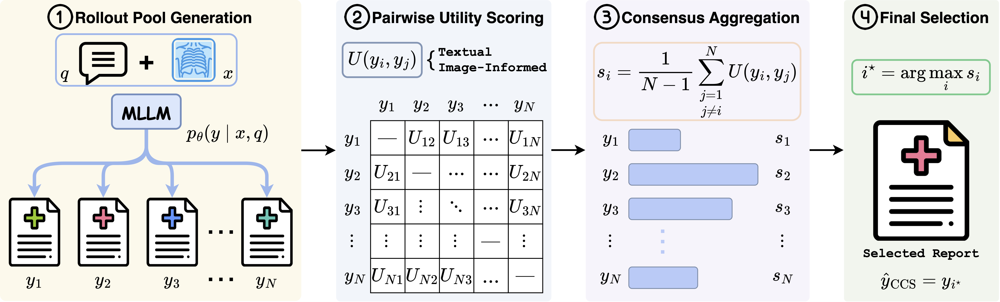

<!-- Add logo here -->
<h1 align="center">
  
  <strong>CCS: Clinical Consensus Selection for Radiology Report Generation</strong>
</h1>


<div align="center">

<a href="https://git.io/typing-svg">
  

[](https://x-izhang.github.io/CCS/)
[](https://arxiv.org/abs/2605.30131)
[](https://github.com/X-iZhang/CCS/blob/main/LICENSE)
[](https://visitorbadge.io/status?path=https%3A%2F%2Fgithub.com%2FX-iZhang%2FCCS)

</div>

## 🔥 News
- **[28 May 2026]** ⛳ Our preprint is now live on [arXiv](https://arxiv.org/abs/2605.30131) — check it out for details.

## Overview
Radiology report generation (RRG) is typically cast as single-path decoding, where a multimodal large language model (MLLM) commits to one report token by token — so a single unfavourable step can drop a finding or assert one the image does not support. Yet a fixed model often places clinically stronger reports *elsewhere in its candidate pool*. We propose **C**linical **C**onsensus **S**election (**CCS**), a *reference-free* and *decoder-agnostic* inference-time framework that reframes RRG as candidate selection: it samples several reports and returns the one with the highest clinical consensus across the rollout pool. **`CCS`** combines text-based agreement utilities with an *image-informed* multimodal utility — an encoder fine-tuned on image–report pairs — capturing clinical agreement beyond surface-level text while reading only the candidate reports. Across three datasets and multiple radiology MLLMs, **`CCS`** consistently improves inference-time quality over single-path decoding and generic Best-of-N baselines, with especially clear gains on clinical metrics — and requires no retraining, no architectural changes, and no reference reports.

<details open>
<summary>CCS's Framework</summary>



</details>

## 📖 Contents
- [📦 Installation](#-installation)
- [🚀 Quick Start](#-quick-start)
- [🎛️ Utilities](#️-utilities)
- [🗂️ Data Format](#️-data-format)
- [📝 Citation](#-citation)
- [🧰 Intended Use](#-intended-use)

## 📦 Installation

> [!TIP]
> Use [`uv`](https://pypi.org/project/uv) for installation — it's faster and more reliable than `pip`.

### Option 1:
Install the latest version directly from GitHub for quick setup:

```bash
uv pip install git+https://github.com/X-iZhang/CCS.git
```

> [!NOTE]
> Requirements: Python 3.11 (`RadEval==0.0.6rc2` requires `>=3.11,<3.12`), and a CUDA-compatible GPU (recommended for the `qwen_vl_emb` utility, which loads a ~4 GB encoder). `RadEval` is pinned to `0.0.6rc2` — the exact version used in the paper; it hard-pins `torch==2.9.1` / `transformers==4.57.3` so the environment stays reproducible.

### Option 2:
If you plan to modify the code or contribute to the project, you can clone the repository and install it in editable mode:

1. Clone the repository and navigate to the project folder

```bash
git clone https://github.com/X-iZhang/CCS.git
cd CCS
```

2. Set up the environment and install in editable mode

```bash
conda create -n CCS python=3.11 -y
conda activate CCS
pip install uv # enable uv support
uv pip install -e .
```

<details>
<summary> 🔄 Upgrade to the latest code base </summary>

```Shell
git pull
uv pip install -e .
```

</details>

## 🚀 Quick Start

A `CCS` instance is a configured set of utilities. Backends load on first call and are reused, so build one selector and call it many times.

```python
import json
from ccs import CCS

reports = [report1, report2, report3, ...]        # a rollout pool from any RRG model

selector = CCS(utilities="qwen_vl_emb")           # our utility (default)
results  = selector(candidates=reports)
print(json.dumps(results, indent=4))
```

```json
[
    {
        "utility": "qwen_vl_emb",
        "text": "the selected report",
        "utility_score": [0.916, 0.897, 0.902, 0.85],
        "selected_idx": 0
    }
]
```

`utility_score` is the consensus score per candidate; `argmax` is the pick.
**The result is always a list, one entry per utility** — the shape never depends on how many you configured.

```python
CCS(utilities=["radgraph", "bleu"])(candidates=reports)   # aliases accepted
```

Each utility selects **independently**; results are never merged.

`details=True` adds `utility_matrix`, the `(N, N)` pairwise similarity matrix the consensus was reduced from (its column-wise mean is exactly `utility_score`):

```python
CCS(utilities="bleu", details=True)(candidates=reports)[0]["utility_matrix"]
```

### CLI

```bash
# Batch over a rollout JSONL
python -m ccs.run_ccs --input-file rollout.jsonl --utilities qwen_vl_emb \
    -N 8 --output-file selected.jsonl

# Single pool; --utilities accepts several names, or `paper` for the paper's set
python -m ccs.run_ccs --reports candidates.json --utilities radgraph bleu
```

### Gradio demo

```bash
uv pip install -e ".[app]"
python -m ccs.app                 # http://127.0.0.1:7860
```

Paste a pool, pick utilities, and see which candidate each one selects and why. `--share` creates a public link (off by default), `--server-name` / `--server-port` control binding.

## 🎛️ Utilities

`PAPER_UTILITIES` — the nine reported in the paper:

| Utility | Family |
|---------|--------|
| `qwen_vl_emb` | **image-informed (ours)** |
| `radgraph_partial` | clinical |
| `chexbert_5` / `chexbert_all` | clinical |
| `ratescore` | clinical |
| `bertscore` / `radeval_bertscore` | embedding |
| `bleu_4` | lexical |
| `rougeL` | lexical |

Also available: `temporal_f1`, `srr_bert`, `green` (a 7B LLM — by far the slowest).

> [!NOTE]
> `qwen_vl_emb` is **image-informed, not image-grounded**: the encoder is fine-tuned on image–report pairs, so its text representation carries clinical information a text-only encoder misses — but at inference it reads reports only, exactly like every other utility.

> [!IMPORTANT]
> `scikit-learn` must be **1.8.0**. 1.9.0 makes `_check_targets` return a 5-tuple, which breaks RadEval's CheXbert scorer with `too many values to unpack (expected 4)`. The pin in `pyproject.toml` handles this; if `chexbert_*` errors, check it first.

## 🗂️ Data Format

CCS operates on a **rollout pool**, so any RRG model that emits N candidates per study can feed it. Each input line:

```json
{"question_id": 1, "text": [{"text": "report 1"}, {"text": "report 2"}, "..."]}
```

`run_jsonl` writes one line per study, keeping the rollout schema so downstream evaluation treats it like any single-path output:

```python
CCS(utilities="qwen_vl_emb").run_jsonl("rollout.jsonl", "selected.jsonl", num_candidates=8)
```

Pre-processed test splits for
[MIMIC-CXR](https://huggingface.co/datasets/X-iZhang/MIMIC-CXR-RRG),
[IU-Xray](https://huggingface.co/datasets/X-iZhang/IU-Xray-RRG) and
[CheXpert Plus](https://huggingface.co/datasets/X-iZhang/CheXpert-plus-RRG) are on
Hugging Face.

For evaluating the selected reports we use
[**RadEval**](https://github.com/jbdel/RadEval) — already a CCS dependency.

> [!TIP]
> Report both a lexical metric (BLEU / ROUGE-L) and a clinical one (CheXbert F1 / RadGraph F1). CCS's gains concentrate on the **clinical** axis.

## 📝 Citation

If you find our paper and code useful in your research and applications, please cite using this BibTeX:

```bibtex
@article{zhang2026ccs,
  title={CCS: Clinical Consensus Selection for Radiology Report Generation},
  author={Zhang, Xi and Li, Yingshu and Meng, Zaiqiao and Lever, Jake and Ho, Edmond SL},
  journal={arXiv preprint arXiv:2605.30131},
  year={2026}
}
```

## 📚 Acknowledgments

This project builds upon the following outstanding open-source works:

- [**Qwen3-VL-Embedding**](https://github.com/QwenLM/Qwen3-VL-Embedding) — Provides the training scripts for the multimodal embedding model behind our image-informed utility.
- [**RadEval**](https://github.com/jbdel/RadEval) — Provides the evaluation framework behind the text utilities.

We thank the authors for their valuable contributions to the open-source and medical AI communities.

## 📨 Contact
For any enquiries or collaboration opportunities, please reach out at: [**x.zhang.6@research.gla.ac.uk**](mailto:x.zhang.6@research.gla.ac.uk)

## 📜 License

This project is released under the MIT License — please see the [LICENSE](LICENSE) file for the full terms.

## 🧰 Intended Use

**CCS** is intended to **support** radiologists, researchers, and medical trainees in **drafting and reviewing chest X-ray reports**, by selecting the most clinically consistent candidate among several model outputs at inference time.

### Key Applications

- 🩺 **Clinical Decision Support** — Surfaces the candidate report that best agrees with the rest of the pool, helping radiologists draft and cross-check preliminary *findings*.
- 🎓 **Educational Tool** — Illustrates how candidate selection and clinical consensus shape report quality, useful for teaching radiology residents and students.
- 🔬 **Research Utility** — Provides a reference-free, decoder-agnostic testbed for studying inference-time selection and image-informed utility in radiology report generation.

> [!IMPORTANT]
> All outputs must be reviewed and validated by **qualified radiologists or medical professionals** before informing any clinical decision.

---

<details>
<summary><strong>Limitations and Recommendations</strong></summary>

1. **Candidate Pool Dependence** — CCS can only select among the reports a base MLLM actually samples; it cannot recover a finding that never appears anywhere in the pool.
2. **Clinical Oversight** — CCS is a *supportive* selection layer, not a replacement for professional medical judgment.
3. **Data Bias** — Selection quality may degrade on underrepresented populations or rare findings where candidate agreement is unreliable.
4. **Generalisation** — Behaviour may vary on image types, decoders, or clinical contexts not represented in our experiments.

</details>

<details>
<summary><strong>Ethical Considerations</strong></summary>

- **Patient Privacy** — All input data must be fully de-identified and compliant with **HIPAA**, **GDPR**, or equivalent local regulations.
- **Responsible Deployment** — Selected reports may still contain inaccuracies; users should interpret them with appropriate caution.
- **Accountability** — Responsibility for clinical verification and safe deployment lies with the **end-user organisation or researcher**.

</details>

<details>
<summary><strong>Disclaimer</strong></summary>

This framework and accompanying tools are intended **solely for research and educational purposes**. CCS is **not approved** by the **FDA**, **CE**, or other regulatory authorities for clinical use. For medical diagnosis or treatment decisions, please consult a **licensed healthcare professional**.

</details>
